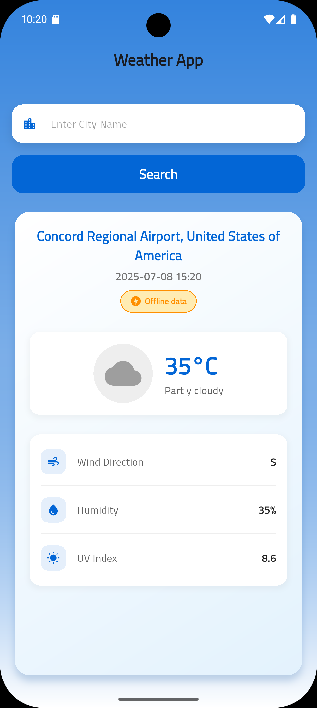
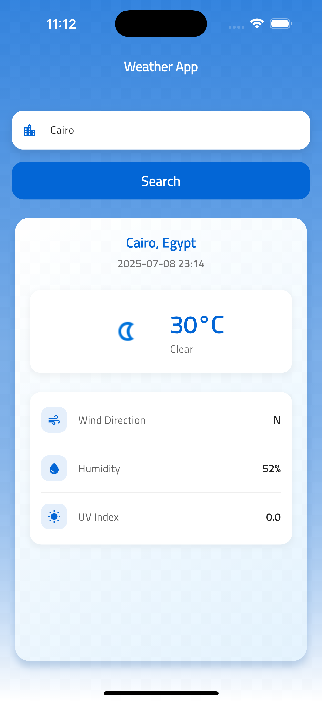

# Weather App

A Flutter weather application that allows users to search for weather information by city name.

## Features

- Real-time weather data display
- Search functionality for different cities
- Weather details including temperature, humidity, wind speed, etc.
- Internet connectivity monitoring

## Screenshots

  
  

## Project Structure

### Core
- **Config**: Application configuration and dependency setup
- **Cubit**: State management for internet connectivity
- **Helpers**: Utility extensions and spacing helpers
- **Navigation**: App routing system
- **Networking**: API services, error handling, and Dio HTTP client
- **Services**: Dependency injection with GetIt
- **Utils**: Common utilities, styles, and shared widgets

### Features

#### Auth
- Splash screen implementation

#### Home
- Weather data handling
- Local and remote data sources
- Weather information display
- Search functionality
- Loading, error, and empty states

## Technical Implementation

- **State Management**: BLoC/Cubit pattern
- **API Integration**: Dio for HTTP requests
- **Caching**: Local storage for weather data
- **Code Generation**: Freezed for immutable state classes
- **Dependency Injection**: GetIt service locator

## Getting Started

1. Clone the repository
2. Run `flutter pub get` to install dependencies
3. Choose development or production environment:
   - For development: `flutter run --flavor development -t lib/main_development.dart`
   - For production: `flutter run --flavor production -t lib/main_production.dart`

## Dependencies

See `pubspec.yaml` for the complete list of dependencies.

